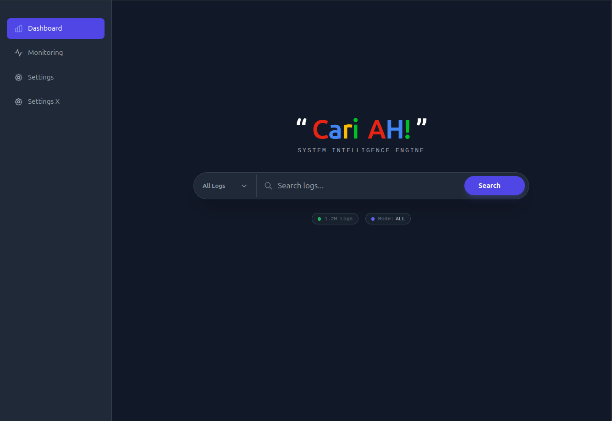

# PHP-Microdata

### Build your micro system with PHP8 and FFi support, ready to up and running with FrankenPHP

#### How to run: please read DEV.txt

#### Testing Results: please read ./test/TEST.txt or ./test/TEST_SUMMARY.json

##### Requirements: PHP 8.5+ with FFI, Golang go1.26.1, rustc 1.94.1, OS: Linux/Mac

##### Database sample: [employees](https://github.com/datacharmer/test_db)

### Youtube Video - Basic Source

### Few Shot Ideas
* PHP and Go collaboration can be achieved primarily through PHP's FFI (Foreign Function Interface) or by embedding PHP within Go using FrankenPHP, with the latter being the modern, supported approach.
* FrankenPHP, a modern PHP app server written in Go, provides a more robust integration path by allowing developers to write PHP extensions directly in Go without writing C code.

### Screenshot Dashboard
 

### Framework Concept and Specifications
#### Core Architecture & Integration
* **Hybrid Execution Engine:** High-performance PHP-Golang integration utilizing **FFI (Foreign Function Interface)** and **FrankenPHP** for shared memory and Go-native execution speeds.
* **Flexible Deployment Artifacts:** Capability to package applications as **Portable Standalone Binaries** or optimized, production-ready **OCI-compliant Docker images**.

#### Security & Validation
* **Zero-Trust Security Layer:** Strict, identity-based access control requiring validated credentials for all service interactions. This layer incorporates **Go-native validation and sanitization**, leveraging high-speed Go libraries to scrub and verify all incoming request payloads before they reach the application logic.
* **Model-Driven Microservices:** A **Schema-First** architecture featuring robust **Struct-based validation** designed specifically for high-integrity microservice development.

#### Data & Modularity
* **Dynamic Persistence Layer:** A decoupled database abstraction allowing for **context-aware connection switching** and runtime database reconfiguration.
* **Versioned Modular Architecture:** Native support for **API and module versioning** to enable seamless horizontal scaling and long-term maintainability.

#### System Operations
* **Unified Task Scheduling:** A dedicated PHP-based **Internal Scheduler** to manage background tasks and cron logic without requiring external system dependencies.
* **Native Observability:** Integrated telemetry with built-in exporters for **Prometheus metrics** and deep integration with **Traefik** for real-time traffic monitoring.

#### Architectural Synergies: PHP & Go Integration

* **Optimized Execution Bridging:** Leveraging **PHP’s FFI (Foreign Function Interface)** and **FrankenPHP** to bridge the gap between PHP’s rapid development cycle and Go’s low-level performance. By embedding PHP within a Go-native server, we eliminate the traditional CGI/FPM overhead in favor of shared-memory execution.
* **Go-Native Extension Development:** Utilizing **FrankenPHP** as the primary integration path to replace legacy C-based extensions. This allows our team to build high-performance system components—such as custom encryption, protocol handling, or data processing—directly in Go while maintaining a clean, familiar interface for the PHP application layer.
* **Simplified Runtime Portability:** Moving beyond traditional LAMP/LEMP stacks by consolidating the entire runtime into a single, Go-managed process. This simplifies horizontal scaling and ensures that the environment remains identical across development, staging, and production.